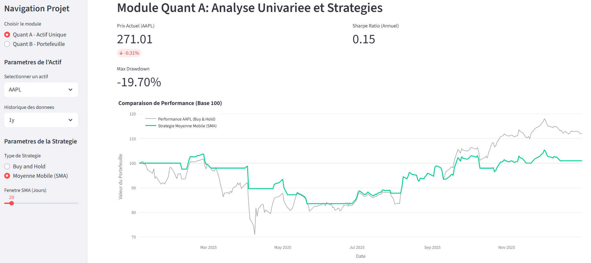
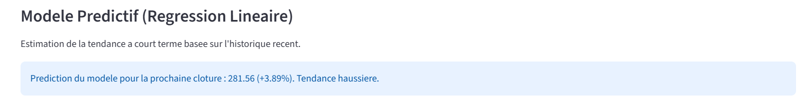
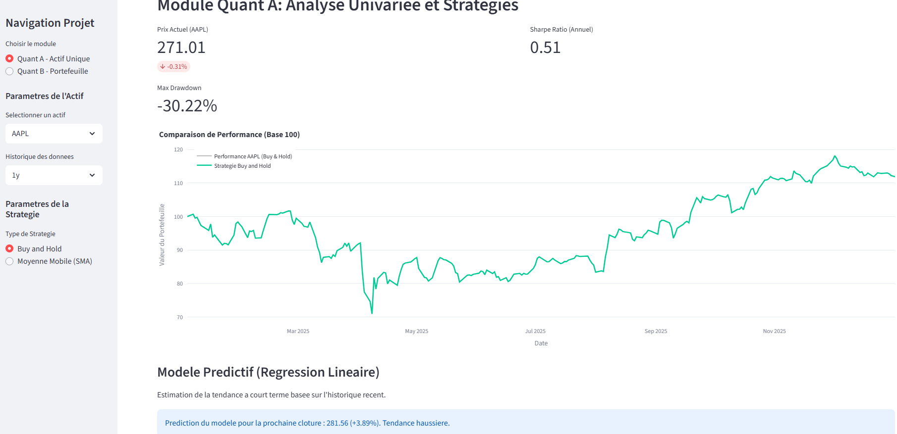
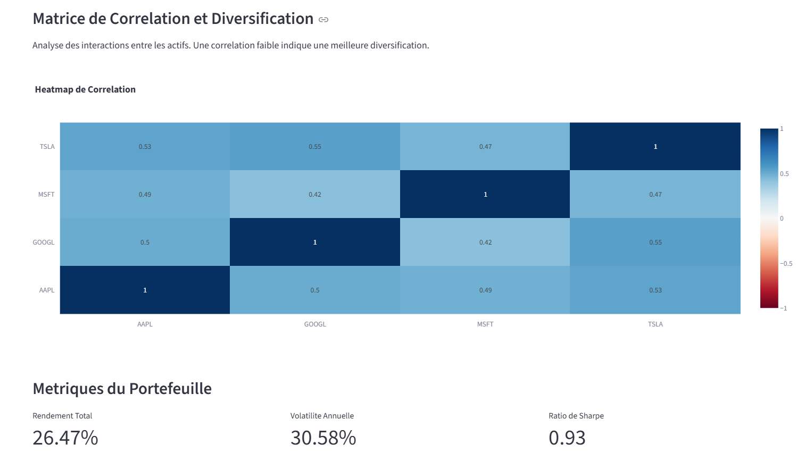
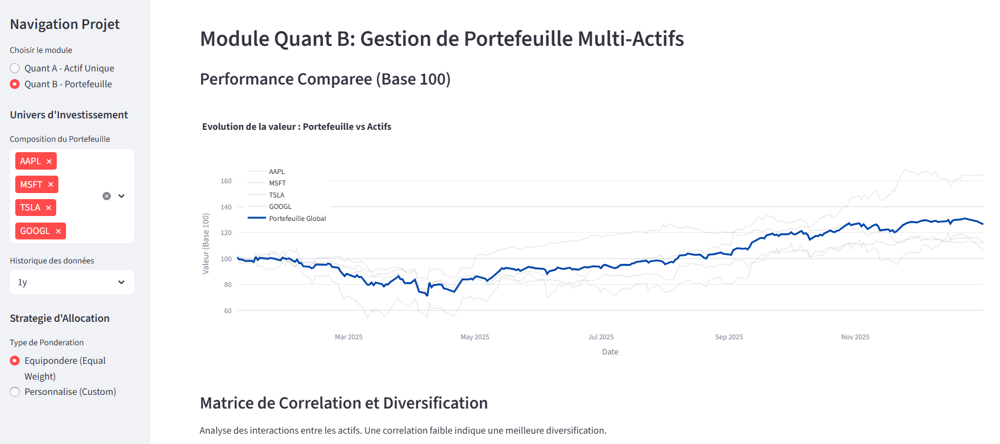

# Rapport Technique : Plateforme d'Analyse Quantitative et de Prediction Financiere

## 1. Introduction et Objectifs du Projet
Ce projet consiste en la conception et le deploiement d'une infrastructure d'analyse financiere integree. L'objectif est de fournir une interface decisionnelle permettant de traiter des donnees de marche en temps reel, d'evaluer la pertinence de strategies algorithmiques et d'anticiper les tendances via l'apprentissage automatique (Machine Learning).

**Membres du groupe :**
* Manelle JIMENEZ DEL PESO
* Fares KHADDOUDI

---

## 2. Module Quant A : Analyse Univariee et Algorithmes de Trading

Le module Quant A repose sur l'etude de series temporelles isolees. Il permet de confronter une gestion passive (Buy and Hold) a une gestion active basee sur le momentum.

### 2.1 Modelisation de la Strategie SMA
La strategie de Moyenne Mobile Simple (SMA) genere des signaux d'achat et de vente selon la regle suivante :
* **Signal d'achat** : $C_t > SMA_n(t)$
* **Signal de vente** : $C_t \leq SMA_n(t)$
*Où $C_t$ represente le prix de cloture a l'instant $t$ et $n$ la fenetre d'observation (par defaut 20 jours).*

### 2.2 Metriques de Performance et Gestion du Risque
Pour valider l'efficacite de l'algorithme, deux indicateurs cles sont calcules :

* **Ratio de Sharpe (Annualise)** : Il mesure l'exces de rendement par unite de risque (volatilite).
  $$S = \frac{E[R_p - R_f]}{\sigma_p} \times \sqrt{252}$$
* **Maximum Drawdown (MDD)** : Il represente la perte maximale subie par un investisseur entre un sommet et un creux.
  $$MDD = \frac{\text{Valeur Crête} - \text{Valeur Creuse}}{\text{Valeur Crête}}$$

### Module Quant A : Analyse Univariée
> 
Analyse de la stratégie de Momentum (SMA) : Cette capture illustre le fonctionnement du backtesting univarié. On y observe la courbe de la stratégie de Moyenne Mobile Simple (en vert) superposée à la performance de l'actif (en gris). Le graphique met en évidence la capacité de l'algorithme à sortir du marché (ligne plate) lors des phases de baisse prolongées pour limiter le Maximum Drawdown, ici calculé à -19.70%.

> 
Module de Prédiction par Régression Linéaire : Vue détaillée de la brique d'Intelligence Artificielle. Le modèle de régression linéaire analyse les tendances récentes pour estimer le prix de clôture de la session suivante. Dans cet exemple, le modèle projette une tendance haussière avec une hausse estimée de +3.89%, fournissant ainsi un indicateur d'aide à la décision complémentaire aux indicateurs techniques classiques.

>
> Vue d'ensemble des indicateurs de performance : Cette vue présente l'interface de contrôle du module Quant A. Elle met en avant les métriques clés de performance ajustées au risque, notamment le Ratio de Sharpe (0.51). L'interface permet une sélection dynamique de l'actif et de l'horizon temporel, recalculant instantanément les statistiques de performance pour l'utilisateur.

---

## 3. Module Quant B : Analyse Multivariee et Gestion de Portefeuille

Ce module traite des problematiques de diversification et d'allocation d'actifs.

### 3.1 Allocation et Rendement Cumule
Le portefeuille est construit selon un vecteur de poids $W = [w_1, w_2, ..., w_n]$. Le rendement total du portefeuille est la somme ponderee des rendements individuels. La visualisation est normalisee sur une **Base 100** pour une lisibilite accrue.

### 3.2 Analyse des Co-mouvements (Correlation)
L'evaluation de la diversification repose sur la matrice de correlation de Pearson. Une correlation proche de 1 indique une redondance du risque, tandis qu'une correlation proche de 0 ou negative indique une diversification optimale.
$$\rho_{X,Y} = \frac{\text{cov}(X,Y)}{\sigma_X \sigma_Y}$$

> 
>  Analyse de la Diversification et des Co-mouvements Texte : Heatmap de la matrice de corrélation de Pearson pour les actifs du portefeuille. Les nuances de bleu indiquent le degré de dépendance entre les titres (ex: corrélation de 0.55 entre TSLA et GOOGL). Cet outil est crucial pour identifier les risques de concentration et s'assurer que les actifs choisis ne réagissent pas de manière identique aux chocs de marché.

> 
> Performance Comparée du Portefeuille Multi-Actifs Texte : Illustration du module de gestion de portefeuille. La ligne bleue grasse représente la valeur liquidative du portefeuille global (base 100), tandis que les lignes grises en arrière-plan tracent la performance individuelle des actifs sélectionnés (AAPL, MSFT, TSLA, GOOGL). Ce graphique démontre visuellement l'effet de lissage de la volatilité grâce à la diversification.
---

## 4. Intelligence Artificielle et Modelisation Predictive

Le projet integre une brique de Machine Learning pour la prediction a court terme ($J+1$).

### 4.1 Regression Lineaire Simple
Le modele utilise une approche par moindres carres ordinaires (OLS) pour estimer la tendance future en se basant sur les 60 dernieres sessions de bourse.
$$y = \beta_0 + \beta_1 x + \epsilon$$

---

## 5. Infrastructure Linux et Automatisation

Le déploiement a été réalisé sur une instance serveur Ubuntu, en appliquant les meilleures pratiques d'isolation et de persistance logicielle.

### 5.1 Environnement Virtuel (Isolation)
Afin de garantir l'intégrité du système et d'éviter les conflits de dépendances, l'application est isolée dans un environnement virtuel Python (`venv`). 
- **Bénéfice** : Isolation complète des bibliothèques (Streamlit, Pandas, yFinance) par rapport au Python natif du serveur.

### 5.2 Persistance du Service via tmux
L'application Streamlit est exécutée au sein d'un multiplexeur de terminaux **tmux** (session nommée `finance`).
- **Fonctionnement** : Cela permet de détacher le processus du terminal actif. Le dashboard reste donc accessible en ligne 24h/24, même après la fermeture de la session SSH.
- **Commande de vérification** : `tmux attach -t finance`

### 5.3 Automatisation des Tâches (Crontab)
Le script d'analyse et de reporting (`daily_report.py`) est automatisé via le planificateur de tâches **Cron**. Il est configuré pour s'exécuter chaque jour à 20h00, utilisant l'interpréteur Python de l'environnement virtuel pour garantir l'accès aux dépendances.

```bash
# Configuration enregistrée dans le Crontab :
00 20 * * * /home/manellejmz/venv/bin/python /home/manellejmz/finance-dashboard-2024/daily_report.py
```

### 5.4 Accès au Dashboard
L'application est déployée et consultable en direct à l'adresse suivante : http://172.25.179.79:8501
